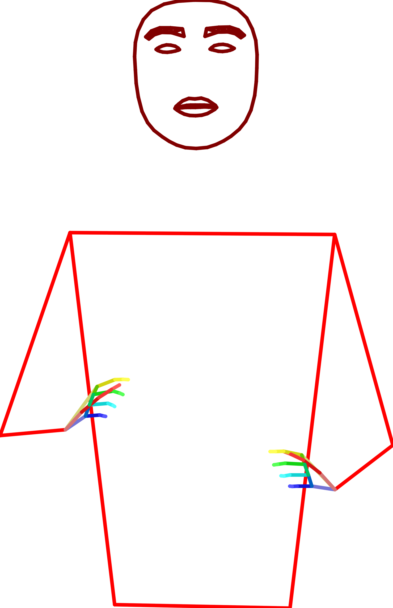

# Data

To train a good compression model, we need a large dataset of sign language poses,
Therefore, this project requires a directory of `.pose` files.

## Downloading Poses

For the purpose of experimentation, I download all poses from SignTube by running:

```bash
gsutil -m rsync gs://sign-mt-poses /scratch/amoryo/poses/sign-mt-poses
```

## Pose Pre-Processing Guidelines

The objective is to standardize the poses, ensuring each component is centered and scaled appropriately.

1. **Normalize by Shoulders:** Adjust the pose based on shoulder positions to maintain a consistent reference.
2. **Remove Legs:** Exclude leg keypoints from the pose.
3. **Hand Position Correction:** Align the hands in the pose to accurately reflect the wrist's position.
4. **Reposition Hands:** Adjust hands so that the wrist coordinates are set to the origin `(0,0,0)`.
5. **Calculate Mean and Standard Deviation:** Compute the mean and standard deviation for all points in the pose. Store
   this in a file.

After calculating the mean, we reposition the hands to the wrists, and visualize the mean pose:



We then preprocess the entire dataset, and store it inside as a huggingface dataset (`huggingface_dataset.py`).
This is because loading and pre-processing 563k pose files takes about 8-9 hours,
and we don't want to repeat this process in every training run.
Furthermore, the original poses contain a header, 543 (X,Y,Z,C) points stored in `float32`, resulting in 508GB in size,
and by storing `float16` data of 178 (X,Y,Z) points and 178 (X,Y,Z) `bool` tensor,
we reduce the size to 45GB (as `.zip` and 280G as a huggingface dataset).

Iterating over the zip dataset takes about 10 minutes, compared to 8-9 hours for the original dataset.

## Benchmarking different dataset storing/loading methods

| Dataset     | Size  | cold start | it/s | it/s (shuffled) | num_workers=4 | num_workers=8 |
|-------------|-------|------------|------|-----------------|---------------|---------------|
| Original    | 508GB | 1s         | 17   | /               | /             | /             | 
| Huggingface | 280G  | 100s       | 21   | 2               | 4             | /             | 
| Zip         | 45GB  | 0s         | 850  | 15              | ERROR         | ERROR         | 
| Directory   | 45GB  | 1s         | 22   | 18              | 36            | 96            | 
